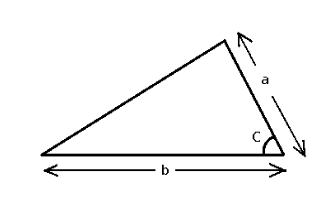
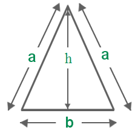
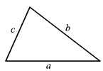

<ul>
<li>a2 &#8211; b2 = (a &#8211; b)(a + b)</li>
<li>(a+b)2 = a2 + 2ab + b2</li>
<li>a2 + b2 = (a &#8211; b)2 + 2ab</li>
<li>(a &#8211; b)2 = a2 &#8211; 2ab + b2</li>
<li>(a + b + c)2 = a2 + b2 + c2 + 2ab + 2ac + 2bc</li>
<li>(a &#8211; b &#8211; c)2 = a2 + b2 + c2 &#8211; 2ab &#8211; 2ac + 2bc</li>
<li>(a + b)3 = a3 + 3a2b + 3ab2 + b3 ; (a + b)3 = a3 + b3 + 3ab(a + b)</li>
<li>(a &#8211; b)3 = a3 &#8211; 3a2b + 3ab2 &#8211; b3</li>
<li>a3 &#8211; b3 = (a &#8211; b)(a2 + ab + b2)</li>
<li>a3 + b3 = (a + b)(a2 &#8211; ab + b2)</li>
<li>(a + b)3 = a3 + 3a2b + 3ab2 + b3</li>
<li>(a &#8211; b)3 = a3 &#8211; 3a2b + 3ab2 &#8211; b3</li>
<li>(a + b)4 = a4 + 4a3b + 6a2b2 + 4ab3 + b4)</li>
<li>(a &#8211; b)4 = a4 &#8211; 4a3b + 6a2b2 &#8211; 4ab3 + b4)</li>
<li>a4 &#8211; b4 = (a &#8211; b)(a + b)(a2 + b2)</li>
<li>a5 &#8211; b5 = (a &#8211; b)(a4 + a3b + a2b2 + ab3 + b4)</li>
<li><strong>If n is a natural number</strong>, an &#8211; bn = (a &#8211; b)(an-1 + an-2b+&#8230;+ bn-2a + bn-1)</li>
<li><strong>If n is even</strong> (n = 2k), an + bn = (a + b)(an-1 &#8211; an-2b +&#8230;+ bn-2a &#8211; bn-1)</li>
<li><strong>If n is odd</strong> (n = 2k + 1), an + bn = (a + b)(an-1 &#8211; an-2b +&#8230;- bn-2a + bn-1)</li>
<li>(a + b + c + &#8230;)2 = a2 + b2 + c2 + &#8230; + 2(ab + ac + bc + ….</li>
<li style="text-align: justify;"><strong>Laws of Exponents 
</strong>(am)(an) = am+n 
(ab)m = ambm 
(am)n = amn = (an)m </li>
<li style="text-align: left;"><strong>Fractional Exponents</strong> 
a0 = 1  <strong> where a &ne; 0 </strong> 
 am / an  = am-n  <strong>if m &gt; n</strong>  
 am / an  = an-m  <strong>if m &lt; n</strong>  
 am = 1 / a-m  
a-m = 1 / am  
 an = a&times;a&times;a&times;a…n times </li>
 
 
 <li style="text-align: left;"><strong>Quadratic Equation: </strong> <em>ax</em>2 + <em>bx</em> + <em>c</em> = 0  
 <strong>Quadratic Formula: </strong>
 
  
If (b2 &minus; 4ac) is the discriminant, then the roots are  
(i) real and unique if (b2 &minus; 4ac) &gt; 0  
(ii) real and equal if (b2 &minus; 4ac) = 0  
(iii) complex conjugate if (b2 &minus; 4ac) &lt; 0  
 
 
 </li>
 
 
 <li style="text-align: left;"><strong>Pythagorean theorem</strong> 
 
   
  (AC)2 = (AB)2 + (BC)2</li>
 
 
 <li>sin&theta; = opposite / hypotenuse </li>
<li>cos&theta; = adjacent / hypotenuse </li>
<li>tan&theta; = opposite / adjacent </li>
<li>cosec&theta; = hypotenuse / opposite </li>
<li>sec&theta; = hypotenuse / adjacent </li>
<li>cot&theta; = adjacent / opposite </li>
   <li>sin&theta; = 1 / cosec&theta; </li>
 <li>cos&theta; = 1 / sec&theta; </li>
 <li>tan&theta; = 1 / cot&theta; </li>
 <li>cosec&theta; = 1 / sin&theta; </li>
 <li>sec&theta; = 1 / cos&theta; </li>
 <li>cot&theta; = 1 / tan&theta; </li>

  <li> tan&theta; = sin&theta; / cos&theta;  </li>
<li>cot&theta; = cos&theta; / sin&theta;  </li>
 <li>sin  2 &theta; +  cos  2 &theta;  = 1   </li>
  <li>tan  2 &theta; + 1 =  sec  2 &theta;    </li>
 <li>cot  2 &theta; + 1 =  cosec  2 &theta;    </li>
<li>sin (&minus; &theta;) =  &minus;sin&theta;    </li>

 <li>cos (&minus; &theta;) =  cos&theta;    </li>
 
 <li>tan (&minus; &theta;) =  &minus;tan&theta;    </li>

 <li>cosec (&minus; &theta;) =  &minus;cosec&theta;    </li>

 <li>sec (&minus; &theta;) =  sec&theta;    </li>
 
 <li>cot (&minus; &theta;) =  &minus;cot&theta;    </li>
  <li>sin (90o &minus; &theta;) =  cos&theta;    </li>
 <li>cos (90o &minus; &theta;) =  sin&theta;    </li>

   <li>tan (90o &minus; &theta;) =  cot&theta;    </li>

 <li>cosec (90o &minus; &theta;) =  sec&theta;    </li>
 <li>sec (90o &minus; &theta;) =  cosec&theta;    </li>
 <li>cot (90o &minus; &theta;) =  tan&theta;    </li>
 
   

 <li>sin (90o &plus; &theta;) =  cos&theta;    </li>
 <li>cos (90o &plus; &theta;) =  &minus;sin&theta;    </li>

   <li>tan (90o &plus; &theta;) =  &minus;cot&theta;    </li>

 <li>cosec (90o &plus; &theta;) =  sec&theta;    </li>
 <li>sec (90o &plus; &theta;) = &minus;cosec&theta;    </li>
 <li>cot (90o &plus; &theta;) =  &minus;tan&theta;    </li>
 
 
 
 
  <li>sin (180o &minus; &theta;) =  sin&theta;    </li>
 <li>cos (180o &minus; &theta;) =  &minus;cos&theta;    </li>

   <li>tan (180o &minus; &theta;) =  &minus;tan&theta;    </li>

 <li>cosec (180o &minus; &theta;) =  cosec&theta;    </li>
 <li>sec (180o &minus; &theta;) =  &minus;sec&theta;    </li>
 <li>cot (180o &minus; &theta;) =  &minus;cot&theta;    </li>
 
   

 <li>sin (180o &plus; &theta;) =  &minus;sin&theta;    </li>
 <li>cos (180o &plus; &theta;) =  &minus;cos&theta;    </li>

   <li>tan (180o &plus; &theta;) =  tan&theta;    </li>

 <li>cosec (180o &plus; &theta;) =  &minus;cosec&theta;    </li>
 <li>sec (180o &plus; &theta;) = &minus;sec&theta;    </li>
 <li>cot (180o &plus; &theta;) =  cot&theta;    </li>
 
 
  <li>sin (360o &minus; &theta;) =  &minus;sin&theta;    </li>
 <li>cos (360o &minus; &theta;) =  cos&theta;    </li>

   <li>tan (360o &minus; &theta;) =  &minus;tan&theta;    </li>

 <li>cosec (360o &minus; &theta;) =  &minus;cosec&theta;    </li>
 <li>sec (360o &minus; &theta;) =  sec&theta;    </li>
 <li>cot (360o &minus; &theta;) =  &minus;cot&theta;    </li>
 
   <li>sin (A &plusmn; B) =  sinA cosB  &plusmn; cosA sinB     </li>
 <li>cos (A &plusmn; B) =  cosA cosB  &mnplus; sinA sinB     </li>
 
 <li>tan (A &plusmn; B) =  (tanA &plusmn; tanB) /  1 &mnplus; (tanA tanB)    </li>
 
  <li>sin2A =  2 sinA cosA       </li>
  <li>cos2A =  cos2A &minus; sin 2A   </li>
   <li>cos2A =  2cos2A &minus; 1   </li>
  <li>cos2A =  1 &minus; 2sin2A    </li>
  <li>tan2A =  2tanA / (1 &minus; tan2A)    </li>
  <li>cot2A =  (cot2A &minus; 1) / 2cotA    </li>
  
  <li style="text-align: left;"><strong>Sine rule</strong> 
 
   
  a / sinA =  b / sinB = c / sinC = d  where d: diameter of the triangle's circumcircle
  
  </li>
  
  <li style="text-align: left;"> <strong>Cosine rule</strong>  
  a2 = b2 &plus; c2 &minus; 2bccosA  
  b2 = a2 &plus; c2 &minus; 2accosB  
  c2 = a2 &plus; b2 &minus; 2abcosC  
  
 
  </li>
  
  <li> <strong> Mollweide's Formula</strong>  
 (a &plus; b) /c =  {cos&frac12; (A &minus; B) / sin&frac12; C}  </li>
  
   <li> <strong> Law of Tangents</strong>  
 (a &minus; b) / (a &plus; b) =  {tan&frac12; (A &minus; B) / tan&frac12; (A &plus; B)}   
 (b &minus; c) / (b &plus; c) =  {tan&frac12; (B &minus; C) / tan&frac12; (B &plus; C)} 
 (a &minus; c) / (a &plus; c) =  {tan&frac12; (A &minus; C) / tan&frac12; (A &plus; C)} 
 
 </li>
  
  
  
  
  
  
  
  <li>sinA &#8729; cosB = [sin(A&plus;B) &plus; sin(A&minus;B)] /2     </li>
  
   <li>cosA &#8729; cosB = [cos(A&plus;B) &plus; cos(A&minus;B)] /2     </li>
  
   <li>sinA &#8729; sinB = [cos(A&plus;B) &minus; cos(A&minus;B)] /2     </li>
  
  <li>sinA &plus; sinB = 2 sin([A&plus;B] /2) cos([A&minus;B] /2)    </li>
  
  
   <li>sinA &minus; sinB = 2 cos([A&plus;B] /2) sin([A&minus;B] /2)    </li>
  <li>cosA &plus; cosB = 2 cos([A&plus;B] /2) cos([A&minus;B] /2)    </li>
   <li>cosA &minus; cosB = &minus;2 sin([A&plus;B] /2) sin([A&minus;B] /2)    </li>
   <li>  x&percnt; = x / 100 </li>
    <li>  Profit = Selling Price &minus; Cost Price </li>
     <li>  &percnt;Profit = {(Selling Price &minus; Cost Price) / Cost Price} x 100 </li>
    <li>   Loss = Cost Price &minus; Selling Price </li>
     <li>   &percnt;Loss = {(Cost Price &minus; Selling Price)/Cost Price} x 100 </li>
     <li>   Simple interest = principal amount &times; interest rate &times; time  
     
   Total compounded interest = principal amount {1  &plus; (r/n)} nt &minus; principal amount 
     where n : the number of times that interest is compounded per year, r : the annual interest rate and t : the number of years the money is borrowed for
      
When interest is only compounded once per year (n=1), the equation simplifies to:  
 Total compounded interest = principal amount {1  &plus; r} t &minus; principal amount 
      
When interest is compounded continually (i.e. n &#8594; &infin;), the compound interest equation takes the form:     
  Total compounded interest = {principal amount &times; ert} &minus; principal amount    
     
     

</li>
     <li>   Discount = list price &times; discount rate </li>
     <li>  Sale price = list price &minus; discount </li>
     <li> Sales tax = price of item &times; tax rate </li>
     
  <li> Area of a triangle = &frac12; &times;base &times; height </li>
  <li> Area of a equilateral triangle = {(square root of 3) / 4} &times; (side) 2 </li>
  
   <li>Semi Perimeter of a equilateral triangle = {3 &times; side} /2  </li>
  
   <li>Height of a equilateral triangle = {(square root of 3) / 2} &times; side  </li>
 
<li> Area of a rectangle = length &times; width </li>
<li> Area of a trapezoid = &frac12; &times; sum of bases &times; height </li>
  <li> Area of a Parallelogram  = base &times; height </li>
   <li> Area of a circle  = pi &times; square of radius </li>
   <li> Circumference of a circle  = 2 &times; pi &times; radius </li>
   <li> Circumference of a circle  = pi &times; diameter </li>
   <li>Area of sector = (θ/360o) (pi &times; radius 2)     </li>
   <li> Length of an arc = (θ/360o) (2 &times; pi &times; radius)      </li>
  <li> Area of a sphere  = 4 &times; pi &times; square of radius </li>
  <li> Area of a square  = length &times; length = length2 </li>
  <li> Area of an Octagon  = 2 &times; (length of any one side of the octagon) 2 &times; (1 &plus; {square root of 2})</li>
  <li> Volume of a cube  = length &times; length &times; length = length3 </li>
  <li> Volume of a rectangle  = length &times; width &times; height </li>
  <li> Volume of a regular prism  = base &times; height </li>
  <li> Volume of a sphere  = 4/3 &times; pi &times; cube of radius </li>
   <li> Volume of a pyramid  = 	&#8531; &times; base &times; height </li>
   <li> Volume of a cylinder  =  pi &times; (radius of the circle of the base)2 &times; height </li>
   
  <li> Volume of a triangular prism  =  area of triangle  &times; height = (&frac12; &times; base &times; height) &times; height </li>
   <li> Diagonal  of a cube  = (square root of 3) &times; length </li>
   <li> Diagonal  of a rectangle  = square root of (length2  &plus; width2)</li>
   <li> Total surface area of a cube  = 6 &times; length2  </li>
    <li> Perimeter of a circle  = 2 &times; pi  &times; radius </li>
   
   <li> Perimeter of a square  = 4 &times; length </li>
   
   <li> Perimeter of a rectangle  = 2 &times; (length &plus; width)</li>
  <li> Perimeter of a triangle  = sum of the lengths of the 3 sides</li>
   <li> ln(mn) = ln(m) &plus; ln(n)</li>
   <li> ln(m/n) = ln(m) &minus; ln(n)</li>
   <li> ln(mn) = nln(m) </li>
   <li> ln(1/m) = &minus;ln(m) </li>
  <li> ln(1) = 0 </li>
   <li> ln(<em>e</em>) = 1 </li>
  <li>ln(x) = 2.303 log10(x)</li>
  <li>lnb(x) = lnd(x) / lnd(b)    </li>
  
  <li>pi (&pi;) = 3.141592653</li>
   <li><em>e</em> = 2.718281828</li>
   <li>Dividend / Divisor = Quotient  </li>
   
   <li> LCM of fractions = LCM of numerators / HCF of denominators </li>
   
   <li>HCF of fractions = HCF of numerators / LCM of denominators  </li>
    <li> LCM of two integers a and b = (a &times; b) / gcd(a,b) , where gcd: Greatest common factor </li>
  
<li><em>e</em> &pi;i &plus; 1= 0</li>
<li> <strong>a1, a2, a3, a4, ....... an </strong>  

If  
a1 is the first term of an arithmetic progression. 
an is the nth term of an arithmetic progression. 
d is the difference between terms of the arithmetic progression. 
d =  a2 &minus; a1 = a3 &minus; a2 
n is the number of terms in the arithmetic progression. 
Sn is the sum of n terms in the arithmetic progression. 
m is the mean value of arithmetic series. 
then  
an = a1 &plus; (n &minus; 1)d  

Sn = (n/2) [2a1 &plus; (n &minus; 1)d]  

Sn = (n/2) (a1 &plus; an) 

m = Sn / n  
m = (a1 &plus; an) / 2   

If  
a1 is the first term of an geometric progression. 
an is the nth term of an geometric progression. 
r is the common ratio. 
r=  a2 / a1 = a3 / a2 
n is the number of terms in the geometric progression. 
Sn is the sum of n terms in the geometric progression. 
then  
an = a1 r (n &minus; 1)  

Sn = a1 (r (n &minus; 1) / r &minus; 1) <strong>when r &ne; 1</strong>  

Sn = a1 n  <strong>when r &equals; 1</strong>  

</li>
  
   <li> a &#8729; b  = b &#8729; a </li>
   
  <li> a &plus; b  = b &plus; a </li>
   
   <li> a &plus; 0  =  a </li>
   
   <li> a &minus; 0  =  a </li>
   
  <li> 0 &minus; a  = &minus;a </li>
   <li> a &plus; (&minus;a)  = 0 </li>
   <li> a &minus; b  = a &plus; (&minus;b) </li>
 <li> a &#8729; 0  =  0 </li>
    <li> 0 / a =  0 </li>
    <li> 1 / (a / b) =  b / a </li>
     <li> a / 1 =  a </li>
     <li> a / b =  na / nb </li>
  <li> a &#8729; 1  =  a </li>
  
   <li> (a / b) n =  a n / b n</li>
  
  
   <li> a &#8729; a&minus;1  =  1 , a &ne; 0 </li>
  <li> a &#8729; (b &plus; c)  =  a &#8729; b &plus; a &#8729; c </li>
  
   <li> a &#8729; (b &#8729; c)  =  (a &#8729; b) &#8729; c </li>
  
  <li> a &plus; (b &plus; c)  =  (a &plus; b) &plus; c </li>
  
   <li> a &plus; (b &plus; c)  =  (a &plus; b) &plus; c </li>
  
  <li>  If a &lt; b and c &lt; d, then a &plus; c &lt; b &plus; d   </li>
  
 <li>  If a &lt; b and c &gt; 0, then ac &lt; bc   </li>
  
  <li>  If a &lt; b and c &lt; 0, then ac &gt; bc   </li>
   <li>  If a &gt; 0 and b &gt; 0, then ab &gt; 0   </li>
    <li>  If a &le; b and b &le; c, then a &le; c   </li>
     <li>  If a &le; b, then a&plus;c &le; b&plus;c   </li>
   
   <li> (a / b) &gt; (c / d) if and only if ad &gt; bc</li>
<li>(a / b) &gt; (c / b), if a &gt; c (a &gt; 0, b &gt; 0, c &gt; 0) </li>
<li>(a / b) &lt; (a / c), if b &gt; c  (a &gt; 0, b &gt; 0, c &gt; 0) </li>
<li> (a / b) &plus; (c / d)  =  (ad &plus; bc) / bd </li>
<li> (a / b) &minus; (c / d)  =  (ad &minus; bc) / bd </li>
 <li> (a / b) &#8729; (c / d)  =  ac / bd </li>  
   
   <li> a &#8729; (c / d)  =  ac / d </li>
   <li><strong>Imaginary unit: i </strong>= (square root of &minus;1)</li>
   
  <li><strong>Powers of the imaginary unit</strong> 
   i 0 = 1  
  i 1 = i  
  i 5 = i  
  i 4n &plus; 1 = i  
  i 2 = &minus;1  
  i 6 = &minus;1  
  i 4n &plus; 2 = &minus;1  
  i 3 = &minus;i  
  i 7 = &minus;i  
  i 4n &plus; 3 = &minus;i  
  i 4 = 1  
  i 8 = 1  
  i 4n &plus; 4 = 1  
  </li>
  
  <li> a &plus; bi = c &plus; di, if a = c and b = d </li>  
   <li> (a &plus; bi) &plus; (c &plus; di) = (a &plus; c) &plus; (b &plus; d)i </li>  
    <li> (a &plus; bi) &minus; (c &plus; di)= (a &minus; c) &plus; (b &minus; d)i </li>  
   <li> (a &plus; bi) (c &plus; di)= (ac &minus; bd) &plus; (ad &plus; bc)i </li>  
   <li>(a &plus; bi) / (c &plus; di) = {(ac &plus; bd) / (c 2 &plus; d 2)} &plus; {(bc &minus; ad) /(c 2 &plus; d 2)} i     </li>

<li> d (u &plus; v) = du &plus; dv </li>
<li> d (u &minus; v) = du &minus; dv </li>
<li> d (uv) = vdu &plus; udv </li>
<li> d (u / v) = (vdu &plus; udv) / v 2 </li>
<li> d (k) = 0  where k : constant </li>
<li> d (ku) = kdu </li>
<li> d (x n) = nx n &minus; 1 dx  </li>
<li> d (lnx) = dx / x </li>
<li> d (sinx) = cosx dx </li>
<li> d (cosx) = &minus;sinx dx </li>
<li> d (tanx) = sec 2x dx </li>
<li> d (cotx) = &minus;cosec 2x dx </li>
<li> d (secx) = secx tanx dx </li>
<li> d (cosecx) =  &minus;cosecx cotx dx </li>
<li> d (1/x) =  &minus;dx /x 2 </li>
<li> d (<em>e</em> x) =  <em>e</em> x dx</li>
<li> d (a x) =  a x lna dx</li>
<li>&int; dx = x &plus; C where C : constant of integration</li>
<li>&int; x ndx = (x n &plus; 1 / n &plus; 1) &plus; C </li>

<li>&int; (dx /x)= lnx &plus; C </li>

<li>&int; <em>e</em> x dx= <em>e</em> x &plus; C </li>

<li>&int; sinx dx = &minus;cosx &plus; C </li>
<li>&int; cosx dx = sinx &plus; C </li>
<li>&int; lnx dx = xlnx &minus; x &plus; C </li>

<li>&int; sec 2x dx = tanx &plus; C </li>
<li>&int; cosec 2x dx = &minus;cotx &plus; C </li>
<li>&int; secx tanx dx = secx &plus; C </li>
<li>&int; cosecx cotx dx = &minus;cosecx &plus; C </li>

<li>&int; tanx dx = &minus;ln &mid; cosx &mid; &plus; C </li>
<li>&int; cotx dx = ln &mid; sinx &mid; &plus; C </li>
<li>&int; secx dx = ln &mid; secx &plus; tanx &mid; &plus; C </li>
<li>&int; cosecx dx = &minus;ln &mid; cosecx &plus; cotx &mid; &plus; C </li>
<li>&int; a x dx = (1 /lna) a x &plus; C ; a &gt; 0, a &ne; 1           </li>
<li> n&#33; = 1 &times; 2 &times; 3 &times; 4 &times; .......&times;n   <strong>when n &gt; 0</strong>        </li>
<li> 0&#33; = 1  <strong>when n = 0 </strong>       </li>
<li> <strong>Euler's Polyhedral Formula: </strong>  
F &plus; V = E &plus; 2	where F: numbers of faces, V: numbers of vertices and E: numbers of edges of a polyhedron    </li>

<li> Probability of an Event = (Number of ways it can happen / Total number of outcomes)   </li>

<li>    </li>
<li>   </li>

<li>   </li>

<li>   </li>

<li> <strong> Length </strong> 
1 kilometre (km) =	10 Hectometres (hm) = 1000 m 
1 Hectometre (hm) =	10 Decametres (dcm) = 100 m 
1 Decametre (dcm) =	10 Metres (m) 
1 Metre (m)	= 10 Decimetres (dm) = 100 cm = 1000 mm 
1 Decimetre (dm) = 10 Centimetres (cm) 
1 decimeter = 0.1 meter 
1 Centimetre (cm) =	10 Millimetres (mm) 
1 centimeter = 0.01 meter 
1 millimeter = 0.001 meter 
1 mile = 1760 yards 
1 mile = 5280 feet 
1 yard = 3 feet 
1 foot = 12 inches 
</li>
<li> <strong>Weight</strong> 
1 milligram = 0.001 gram 
1 centigram = 0.01 gram 
1 decigram = 0.1 gram 
1 kilogram = 1000 grams 
1 gram = 1000 milligrams 
1 ton = 2000 pounds 
1 pound = 16 ounces 
</li>
<li> <strong>Volume</strong>  
1 teaspoon	=	4.9 milliliters 
1 cup	=	237 milliliters 
1 cup = 8 ounces 
1 pint	=	473 milliliters 
1 quart	=	0.9 liters 
1 gallon =	3.79 liters 
1 gallon = 4 quarts 
1 gallon = 128 ounces 
1 milliliter = 0.001 liter 
1 centiliter = 0.01 liter 
1 deciliter = 0.1 liter 
1 kiloliter = 1000 liters 
1 quart = 2 pints 
1 pint = 2 cups 
</li>
<li> <strong>Time</strong> 
1 hour = 60 minutes 
1 minute = 60 seconds 
1 hour = 60 minutes = 3600 seconds (60 &times; 60) 
1 day = 24 hours 
1 week = 7 days 
1 year = 365 days 
1 year = 12 months 
1year = 52 weeks 
</li>

<li><strong> SI Prefixes </strong> 

  <table bgcolor=#ffffff>
              <tr bgcolor="#99CCFF"> 
                <td><b>Number</b></td>
                <td><b>Prefix</b></td>
                <td><b>Symbol</b></td>
              </tr>
              <tr> 
                <td>10 1</td>
                <td>deka-</td>
                <td>da</td>
              </tr>
              <tr> 
                <td>10 2</td>
                <td>hecto-</td>
                <td>h</td>
              </tr>
              <tr> 
                <td>10 3</td>
                <td>kilo-</td>
                <td>k</td>
              </tr>
              <tr> 
                <td>10 6</td>
                <td>mega-</td>
                <td>M</td>
              </tr>
              <tr> 
                <td>10 9</td>
                <td>giga-</td>
                <td>G</td>
              </tr>
              <tr> 
                <td>10 12</td>
                <td>tera-</td>
                <td>T</td>
              </tr>
              <tr> 
                <td>10 15</td>
                <td>peta-</td>
                <td>P</td>
              </tr>
              <tr> 
                <td>10 18</td>
                <td>exa-</td>
                <td>E</td>
              </tr>
              <tr> 
                <td>10 21</td>
                <td>zeta-</td>
                <td>Z</td>
              </tr>
              <tr> 
                <td>10 24</td>
                <td>yotta-</td>
                <td>Y</td>
              </tr>
       
  <tr> 
             <td>10 -1</td>
             <td>deci-</td>
                <td>d</td>
              </tr>
              <tr> 
                <td>10 -2</td>
                <td>centi-</td>
                <td>c</td>
              </tr>
              <tr> 
                <td>10 -3</td>
                <td>milli-</td>
                <td>m</td>
              </tr>
              <tr> 
                <td>10 -6</td>
                <td>micro-</td>
                <td>&mu;</td>
              </tr>
              <tr> 
                <td>10 -9</td>
                <td>nano-</td>
                <td>n</td>
              </tr>
              <tr> 
                <td>10 -12</td>
                <td>pico-</td>
                <td>p</td>
              </tr>
              <tr> 
                <td>10 -15</td>
                <td>femto-</td>
                <td>f</td>
              </tr>
              <tr> 
                <td>10 -18</td>
                <td>atto-</td>
                <td>a</td>
              </tr>
              <tr> 
                <td>10 -21</td>
                <td>zepto-</td>
                <td>z</td>
              </tr>
              <tr> 
                <td>10 -24</td>
                <td>yocto-</td>
                <td>y</td>
              </tr>
            </table>
                 

 </li>

<li> <strong> Roman numerals  </strong>  
1 = I 
2 = II 
3 = III 
4 = IV 
5 = V 
6 = VI 
7 = VII 
8 = VIII 
9 = IX 
10 = X 
11 = XI 
12 = XII 
13 = XIII 
14 = XIV 
15 = XV 
16 = XVI 
17 = XVII 
18 = XVIII 
19 = XIX 
20 = XX 
21 = XXI 
25 = XXV 
30 = XXX 
40 = XL 
49 = XLIX 
50 = L 
51 = LI 
60 = LX 
70 = LXX 
80 = LXXX 
90 = XC 
99 = XCIX 
 </li>

<li>Profit margin = (net profits / net sales)   </li> 

<li>Profit margin = = (net sales &minus; expenses) / net Sales  </li>

<li>Gross Profit margin = (Gross Profit / net sales)   </li> 

<li> Percentage Increase = (Increased Value / Original Value) &times; 100 </li>

<li> Percentage Decrease = (Decreased Value / Original Value) &times; 100 </li>

<li> If probability of happening an event is X then probability of not happening that event is (1 &minus; X). </li>

<li> Root mean square (Xrms) = square root of {(x12 &plus; x22 &plus; x32 &plus; x42 &plus; ................ &plus; xn2) / n} </li>

<li> <strong> Ratio formula: </strong>  

a &ratio; b &rarr; a / b </li>

<li>Angle in radians = (angle in degrees &times; &pi; ) / 180o    </li>

<li>Relative standard deviation = (Standard deviation &times; 100) / Mean of the data </li>

<li> Base area of a hexagonal pyramid = 3 &times; (apothem length &times; base length)    </li>
<li> Surface area of a hexagonal pyramid = 3 &times; {(apothem length &times; base length) &plus; (base length &times; slant height) } </li>
<li> Volume of a hexagonal pyramid = apothem length &times; base length &times; height </li>
<li> <strong> Number of permutations of n different things taking r at a time is</strong>  
P (n, r) = n&excl; / (n &minus; r)&excl;

</li>

<li> <strong> Number of combinations of n different things taking r at a time is</strong>  
C (n, r) = n&excl; / {(n &minus; r)&excl; &times; r&excl;}

</li>

<li> Weighted Average = (Sum of Weighted Terms / Total Number of Terms) </li>

<li> Square footage = length &times; breadth  
For a triangular area,  
Square footage = (breadth &times; length) / 2 </li>

<li> Area of the Ellipse =  &pi; &times; semi major axis of the ellipse &times; semi minor axis of the ellipse</li>

<li> Perimeter of the Ellipse = 2 &times; &pi; &times; square root of ({semi major axis of the ellipse2 &plus; semi minor axis of the ellipse2} /2)</li>

<li> Percentage difference = [(x1 &minus; x2) / {(x1 &plus; x2) /2} ] &times; 100 </li>

<li> Percentage yield = [actual yield  / theoretical yield ] &times; 100 </li>

<li> Percentage composition of element X = [ total amount of element X present in the compound  / total amount of all the elements present in the compound] &times; 100 </li>

<li>  <strong> Fibonacci Formula: </strong>  
Fn = Fn&minus;1 &plus; Fn&minus;2  
For fibonacci series 0, 1, 1, 2, 3, 5, 8, 14,……  
F9 = F9&minus;1 &plus; F9&minus;2  
F9 = 14 &plus; 8  
F9 = 22  </li>

<li> Kelvin = Celsius &plus; 273</li>
<li> Fahrenheit = Celsius &times; (9 /5) &plus; 32</li>

<li> Rate of capability (Cp) = (upper specification limit &minus; lower specification limit) / (6 &times; standard deviation) </li>

<li> Distance moved by a wheel in one revolution = Circumference of the wheel. </li>

<li> Number of revolutions = (Total distance moved / Circumference of the wheel)  </li>

<li> <strong> Measures of Central Tendency      </strong>  
For un-grouped data  
Arithmetic Mean = (Sum of observations / Number of observations)  
Mode = The most frequently occurred value of the raw data. 
Median = (N &plus; 1)/2, in case of the data is having odd no of observations  
Median = [(N / 2) &plus; (N &plus; 1)/2)] / 2, in case of the data is having even number of observations.  

For grouped data  
Arithmetic Mean =  (Sum of the product of frequencies and corresponding observations / Sum of all the frequencies)

</li>

<li>Sampling error = &plusmn; square root of (2500 / sample size) &times; 1.96  </li>

<li>Portfolio variance = (weight of the asset 1 &times; variance of the asset 1) &plus; (weight of the asset 2 &times; variance of the asset 2) &plus; 2 &times; (weight of the asset 1 &times; weight of the asset 2 &times; covariance between assets 1 and 2) </li>

<li>Correlation between assets 1 and 2 = (covariance between assets 1 and 2) / (standard deviation of asset 1 &times; standard deviation of asset 2)</li>

<li>  Portfolio standard deviation = square root of (Portfolio variance) </li>

<li> Angle of a segment in a circle = (arc length &times; 360) / (2 &times; pi &times; radius) </li>

<li> Length of a chord of a circle  = 2 &times; radius &times; sin (angle subtended at the center by the chord /2) </li>

<li> Length of a chord of a circle  = 2 &times; square root of (radius2 &minus; {perpendicular distance from the chord to the circle center}2) </li>
 
<li>
Cohen's index = (Mean of first observation &minus; Mean of second observation) / square root of ({Standard deviation of first observation 2 &plus; Standard deviation of second observation 2} /2) </li>
 <li> Effect-size coefficient = (Cohen's index) / square root of ({Cohen's index} 2 &plus; 4) </li>
 <li> <strong> One Sample T Test Formula   </strong>  
Number of degrees of freedom = (number of values in the data set) &minus; 1 </li>
<li> <strong> Two Sample T Test Formula   </strong>  
Number of degrees of freedom = (number of values in the data set 1  &plus; number of values in the data set 2) &minus; 2 </li>

<li> <strong> Two Sample T Test Formula   </strong>  
Number of degrees of freedom = (number of values in the data set 1  &plus; number of values in the data set 2) &minus; 2 </li>

<li>Relative standard deviation = (Standard deviation &times; 100) / Mean of the data </li>

<li><strong> Rotation formula</strong>  
Rotation 90o : R90 degree (x, y) = (&minus;y, x)  
Rotation 180o : R180 degree (x, y) = (&minus;x, &minus;y)  
Rotation 270o : R270 degree (x, y) = (&minus;x, y)  
</li>

<li>8 &times; 10 2 = 800</li> 

<li>7.3 &times; 10 &minus;6 = 0.0000073   </li>

<li><strong> Powers of Ten</strong>  
billions 
109 = 1,000,000,000  
10 &times; 10 &times; 10 &times; 10 &times; 10 &times; 10 &times; 10 &times; 10 &times; 10 = 1,000,000,000  
millions  
106 = 1,000,000  
10 &times; 10 &times; 10 &times; 10 &times; 10 &times; 10 = 1,000,000 
hundred thousands 
105 = 100,000 
10 &times; 10 &times; 10 &times; 10 &times; 10 = 100,000 
ten thousands 
104 = 10,000 
10 &times; 10 &times; 10 &times; 10 = 10,000 
thousands 
103 = 1,000 
10 &times; 10 &times; 10 = 1,000 
hundreds 
102 = 100 
10 &times; 10 = 100 
tens 
101 = 10 
ones 
100 = 1 
tenths 
10&minus;1 = 1/10 
1/10 = 0.1 
hundredths 
10&minus;2 = 1/102 
1/102 = 0.01 
thousandths 
10&minus;3 = 1/103 
1/103 = 0.001 
ten thousandths 
10&minus;4 = 1/104 
1/104 = 0.0001 
hundred thousandths 
10&minus;5 = 1/105 
1/105 = 0.00001 
millionths 
10&minus;6 = 1/106 
1/106 = 0.000001 
billionths 
10&minus;9 = 1/109 
1/109 = 0.000000001  

 </li>

 <li>Margin of error = critical value &times;  standard deviation</li>
 
 <li> <strong> Side Angle Side Formula</strong>
   
 
 Area = (ab sinC) /2 
 
 
 
 
 
 </li>
 
 <li> <strong>Quartile Formula </strong> 
 
Lower quartile (Q1) = ({n &plus; 1} /4) th Term  
 
Second quartile (Q2) = ({n &plus; 1} /2) th Term  
 
Upper quartile (Q3) = ([3 {n &plus; 1}] /4) th Term  

Inter quartile range = Q3 &minus; Q1  

n : number of values in the data set

 </li>
 
 <li> <strong>Double Time Formula </strong> 
 
Doubling time = log2 / log(1 &plus; content growth rate) 

 </li>
 
 <li>   <strong> Isosceles Triangle Formulas</strong>
   

Area of an Isosceles Triangle = &frac12; &times; b &times; h  
Perimeter of an Isosceles Triangle = 2a &plus; b  
Altitude of an Isosceles Triangle = square root of (a2 &minus; {b2 /4})  

</li>

 <li>   <strong> Triangle Inequality Theorem </strong>
   

a &plus; b &gt; c  

a &plus; c &gt; b  

b &plus; c &gt; a  

</li>

<li>Total Cost = (Number of Units) &times; (Price per Unit)    </li>

<li>The distance between two points (x1, y1) and (x2, y2) =
 square root of ( {x2  &minus; x1} 2 &plus; {y2  &minus; y1} 2 )

  </li>

<li> y = mx &plus; b, where m is the slope of the line and b is the y-intercept of the line, or the y-coordinate of the point at which the line crosses the y-axis.   </li>

<li>Natural Numbers: {1, 2, 3, ......}   </li>
<li>Whole Numbers: {0, 1, 2, 3, ......}   </li>
<li>Integers: {..., &minus;3, &minus;2, &minus;1, 0, 1, 2, 3, ...}  </li>

<li> Complex conjugate of 3 &plus; 4i is 3 &minus; 4i </li>

<li> 1 / (cos&phi; &plus; isin&phi;) = [cos(&minus; &phi;) &plus; isin(&minus; &phi;)]   </li>

<li> (cos&phi; &plus; isin&phi;) n = [cos(n&phi;) &plus; isin(n&phi;)]   </li>
<li> {(cos&phi;1 &plus; isin&phi;1) / (cos&phi;2 &plus; isin&phi;2)}  = 
 [cos(&phi;1 &minus; &phi;2) &plus; isin(&phi;1 &minus; &phi;2)]   </li>

<li> e ix = cosx &plus; isinx </li>
<li> e &minus;ix = cos(&minus;x) &plus; isin(&minus;x) </li>

<li>Area of a triangle = square root of { s(s&minus;a)(s&minus;b)(s&minus;c) } , where a, b, c are the lengths of the sides and s = &frac12; (a &plus; b &plus; c) (s represents the semi-perimeter of the triangle)

</li>

<li> Area of a trapezoid = &frac12; &times; h &times; (b1 &plus; b2), where h = height, b1 and b2 are parallel sides  </li>

<li> Area of a rhombus = &frac12; &times; d1 &times; d2, where d1 and d2 are the lengths of the diagonals  </li>

<li>Area of a rhombus =  (length of any side)2 &times; sin(any interior angle) </li>

<li>Area of a regular polygon = &frac12; &times; apothem &times; perimeter

 

The number of degrees in a circle is 360 

The number of radians in a circle is 2&pi; 

The number of degrees in a triangle is 180 
Full circle = 360o

</li>

<li> Half Life = (0.693 / disintegration constant) </li>

<li> Volume of a Parallelepiped = area of the bottom &times; height </li>

<li> Area of a Tangential quadrilateral =  square root of (a &times; b &times; c &times; d), where a, b, c and d are the lengths of the sides     </li>

<li> Area of a Tangential quadrilateral =  (radius of inscribed circle &times; semi-perimeter), where semi-perimeter = &frac12; &times;
(a &plus; b &plus; c &plus; d)

</li>

<li>sin&minus;1 (sin x) = x </li>
<li>cos&minus;1 (cos x) = x </li>
<li>tan&minus;1 (tan x) = x </li>
<li>cosec&minus;1 (cosec x) = x </li>
<li>sec&minus;1 (sec x) = x </li>
<li>cot&minus;1 (cot x) = x </li>
<li>sin&minus;1 (1/x) = cosec&minus;1 (x)</li>
<li>cos&minus;1 (1/x) = sec&minus;1 (x)</li>
<li>tan&minus;1 (1/x) = cot&minus;1 (x) ,  x &gt; 0</li>
<li>tan&minus;1 (1/x) = {&minus;&pi; &plus; cot&minus;1 (x)} ,  x &lt; 0</li>
<li>sin&minus;1 (&minus;x) = &minus;sin&minus;1 (x)</li>
<li>cos&minus;1 (&minus;x) = &pi; &minus; cos&minus;1 (x)</li>
 <li>tan&minus;1 (&minus;x) = &minus;tan&minus;1 (x)</li>
 <li>cot&minus;1 (&minus;x) = &pi; &minus; cot&minus;1 (x)</li>
 <li>sec&minus;1 (&minus;x) = &pi; &minus; sec&minus;1 (x)</li>
 <li>cosec&minus;1 (&minus;x) = &minus; cosec&minus;1 (x)</li>
 <li> sin&minus;1 (x)  &plus;  cos&minus;1 (x) = &pi; / 2 </li>
  <li> tan&minus;1 (x) &plus; cot&minus;1 (x) = &pi; / 2 </li>
 <li> sec&minus;1 (x) &plus; cosec&minus;1 (x) = &pi; / 2 </li>
 <li> tan&minus;1 (x) &plus; tan&minus;1 (y) = tan&minus;1 ( x &plus; y /1  &minus; xy) </li>
<li> tan&minus;1 (x) &minus; tan&minus;1 (y) = tan&minus;1 ( x &minus; y /1  &plus; xy) </li>
 <li>2tan&minus;1 (x) = sin&minus;1 (2x / 1 &plus; x2)   </li>
 <li>2tan&minus;1 (x) = cos&minus;1 (1 &minus; x2 / 1 &plus; x2)   </li>
 <li>2tan&minus;1 (x) = tan&minus;1 (2x / 1 &minus; x2)   </li>
 <li>sin (&omega;&theta;) &rArr; T = (2&pi; / &omega;) </li>
 <li>cos (&omega;&theta;) &rArr; T = (2&pi; / &omega;) </li>
  <li>tan (&omega;&theta;) &rArr; T = (&pi; / &omega;) </li>
 <li>cosec (&omega;&theta;) &rArr; T = (2&pi; / &omega;) </li>
 <li>sec (&omega;&theta;) &rArr; T = (2&pi; / &omega;) </li>
  <li>cot (&omega;&theta;) &rArr; T = (&pi; / &omega;) </li>
 <li> sin&theta; = &plusmn; square root of {[1 &minus; cos(2&theta;)] /2}  </li>
 <li> cos&theta; = &plusmn; square root of {[1 &plus; cos(2&theta;)] /2}  </li>
 <li> tan&theta; = &plusmn; square root of {[1 &minus; cos(2&theta;)] / [1 &plus; cos(2&theta;)]}  </li>
 <li> sin(&theta; &plus; 2&pi;n) = sin &theta; , where n is an integer</li>
 <li> cos(&theta; &plus; 2&pi;n) = cos &theta;</li>
 <li> tan(&theta; &plus; &pi;n) = tan &theta;</li>
 <li> cosec(&theta; &plus; 2&pi;n) = cosec &theta; </li>
 <li> sec(&theta; &plus; 2&pi;n) = sec &theta;</li>
 <li> cot(&theta; &plus; &pi;n) = cot &theta;</li>
 <li> (&minus;a)1/2 =    i (a)1/2 ;</li>
 <li> sin {&theta; &plus; (&pi; /2)} = cos&theta;</li>
 <li> sin&theta; = cos{&theta; &minus; (&pi; /2)} </li>
 
 <li> sin&minus;1 x = arcsinx  </li>
 <li> cos&minus;1 x = arccosx  </li>
 <li> tan&minus;1 x = arctanx  </li>
 
 <li> If a &gt; b, then b &lt; a  </li>
 <li> If a &gt; b, then (a &minus; b) &gt; 0 or (b &minus; a) &lt; 0  </li>
<li> If a &gt; b and m &gt; 0, then ma &gt; mb  </li>
 <li> If a &gt; b and m &gt; 0, then (a / m) &gt; (b / m)  </li>
 <li> If a &gt; b and m &lt; 0, then ma &lt; mb  </li>
 <li> If a &gt; b and m &lt; 0, then (a / m) &lt; (b / m)  </li>
 <li> If 0 &lt; a &lt; b and n &gt; 0, then an &lt; bn  </li>
  <li> If 0 &lt; a &lt; b and n &lt; 0, then an &gt; bn  </li>
  <li> If 0 &lt; a &lt; b, then a1/n &lt; b1/n  </li>
  <li> If ax &plus; b &gt; 0  and a &gt; 0, then x &gt; &minus; (b/a)  </li>
  <li> If ax &plus; b &gt; 0  and a &lt; 0, then x &lt; &minus; (b/a)  </li>
 <li> cos (sin&minus;1 x) = (1 &minus; x2)1/2      </li>
 <li> tan (sin&minus;1 x) = x / (1 &minus; x2)1/2     </li>
  <li> cot (sin&minus;1 x) =  (1 &minus; x2)1/2 / x     </li>
  <li> sec (sin&minus;1 x) = 1 / (1 &minus; x2)1/2       </li>
  <li> cosec (sin&minus;1 x) = 1 / x       </li>
 
   <li>sin3&theta; =  3cos2&theta; sin&theta; &minus; sin3&theta;  </li>
   <li>cos3&theta; =  cos3&theta; &minus; 3 sin2&theta; cos&theta; </li>
 <li>tan3&theta; =  (3tan&theta; &minus; tan3&theta;) / (1 &minus; 3tan2&theta;)  </li>
  <li>cot3&theta; =  (3cot&theta; &minus; cot3&theta;) / (1 &minus; 3cot2&theta;)  </li>
   <li>tan(n &plus; 1)&theta; = (tann&theta; &plus; tan&theta;) / (1 &minus; tann&theta; tan&theta;) </li>
  <li>cot(n &plus; 1)&theta; = (cotn&theta; cot&theta; &minus; 1) / (cotn&theta; &plus; cot&theta;) </li>
  
  <li> The sum of the interior angles of a convex polygon = (n &minus; 2)180o, n is the number of sides </li>
  <li>The sum of the exterior angles of a convex polygon, taken one at each vertex, is 360o  </li>
   <li>The measure of an exterior angle of a regular n- sided polygon is  360o/n  </li>
  <li>The measure of the interior angle of a regular n-sided polygon is (n &minus; 2)180o/n</li>
  <li>The number of diagonals of in an n-sided polygon is n(n &minus; 3)/2</li>
  
  
<li> The number of triangle in a polygon = (n &minus; 2)</li>

<li>Volume of a square pyramid = 	&#8531; &times; base2 &times; height </li>

<li>Volume of a triangular pyramid = 	1/6 &times;apothem &times; base &times; height </li>  
  
<li>Volume of a pentagonal pyramid = 	5/6 &times;apothem &times; base &times; height </li>  
  
<li>Volume of a hexagonal pyramid = 	apothem &times; base &times; height </li> 

<li>  sin4A = 4cos3A sinA &minus; 4cosA sin3A</li>

 <li>  cos4A = cos4A  &minus; 6cos2A sin2A &plus; sin4A </li> 
  
  <li>tan4A = (4tanA &minus; 4tan3A) / (1 &minus; 6tan2A &plus; tan4A)  </li>
  <li>cot4A = (cot4A &minus; 6cot2A &plus; 1) / (4cot3A &minus; 4cotA) </li>
  <li> sin(A &plus; B) sin(A &minus; B)=sin2A &minus; sin2B  </li>
  <li> cos(A &plus; B) cos(A &minus; B)=cos2A &minus; cos2B  </li>
 
 <li> <strong> Types of Triangles: </strong>  
Isosceles (two equal sides) 
Equilateral (all sides equal) 
Right (one 90o or right angle) 

</li>

<li>Sum of the Angles (all triangles):  
A + B + C = 180o
 </li>
<li>  Average = sum of terms / number of terms </li>

<li> Average speed = total distance / total time </li>

<li>Sum = average &times; (number of terms)   </li>

<li>Mode = value in the list that appears most often   </li>

<li> Range : subtract the lowest value from the highest value </li>

<li> Median = middle value in the list   
median of {3, 9, 10, 27, 50} = 10  
median of {3, 9, 10, 27} = (9 &plus; 10)/2 = 9.5  
 </li>

<li><strong>Fundamental Counting Principle: </strong>  
If an event can happen in N ways, and another, independent event can happen in M ways, then both events together can happen in
N &times; M ways. (Extend this for three or more: N1 &times; N2 &times; N3 . . . )</li>

<li>  Part = (percent / 100) &times; whole</li>

<li> The length of one side of any triangle is always less than the sum and more than the difference of the lengths of the other two sides. </li>

<li> Slope of the line that goes through points A (x1, y1) and B (x2, y2) = (y2 &minus; y1) / (x2 &minus; x1)</li>

<li> <strong> Standard Equation of a circle </strong>  
(x &minus; h) 2  &plus; (y &minus; k) 2 = r2, where r is the radius and center at (h, k) </li>

<li> <strong> Exponential Series: </strong>  
(i) For all x, ex = 1 &plus; x/1&excl; &plus; x2/2&excl; &plus; x3/3&excl; &plus; …………… &plus; xr/r&excl; &plus; ………….. ∞. 
(ii) e = 1 &plus; 1/1&excl; &plus; 1/2&excl; &plus; 1/3&excl; &plus; ………………….. &#8734;. 
(iii) 2 &lt; e &lt; 3; e = 2.718282 (correct to six decimal places).  
(iv) ax = 1 &plus; (loge a) x &plus; [(loge a)2/2&excl;] ∙ x2 &plus; [(loge a)3/3&excl;] ∙ x3 &plus; …………….. ∞. 
 
 </li>

<li><strong>Variation:</strong>  
(i) If x varies directly as y, we write x &prop; y or, x = <i>k</i>y where <i>k</i> is a constant of variation.  
(ii) If x varies inversely as y, we write x &prop; 1/y or, x = <i>m</i> ∙ (1/y) where <i>m</i> is a constant of variation.  
(iii) If x &prop; y when <i>z</i> is constant and x &prop; z when<i> y</i> is constant then x &prop; <i>y</i>z when both <i>y</i> and <i>z</i> vary. 

 </li>

</ul>

  

<strong> Best Books for JEE Main & Advanced </strong>

1.  Maths Wonder By Alfred S.Posamentier 
              
      <a href="https://github.com/manjunath5496/Formulas/blob/master/m1.pdf" target="_blank" style="text-decoration:none">  
 Download
 </a> 

2.  Trignometry Demystified By Stan Gibilisco  <a href="https://github.com/manjunath5496/Formulas/blob/master/m2.pdf" target="_blank" style="text-decoration:none">  
 Download
 </a> 

3.  Career Numbers By Rebecca Burnett  <a href="https://github.com/manjunath5496/Formulas/blob/master/m3.pdf" target="_blank" style="text-decoration:none">  
 Download
 </a> 

4.  Measure Integration & Probability By Ivan F Wilde  <a href="https://github.com/manjunath5496/Formulas/blob/master/m4.pdf" target="_blank" style="text-decoration:none">  
 Download
 </a> 

5.  Number Theory By David A. Santos  <a href="https://github.com/manjunath5496/Formulas/blob/master/m5.pdf" target="_blank" style="text-decoration:none">  
 Download
 </a> 

6.  Objective Mathematics By S.K Goyal  <a href="https://github.com/manjunath5496/Formulas/blob/master/m6.rar" target="_blank" style="text-decoration:none">  
 Download
 </a> 

7.  Physical Chemistry Numerical Problems & Solutions for IIT - JEE By P. Bahadur  <a href="https://github.com/manjunath5496/Formulas/blob/master/m7.rar" target="_blank" style="text-decoration:none">  
 Download
 </a> 

8.  11 Years JEE Main Chapter-wise Solved Papers (2002-12)  <a href="https://github.com/manjunath5496/Formulas/blob/master/m8.pdf" target="_blank" style="text-decoration:none">  
 Download
 </a> 

9.  41 Years (1978-2018) JEE Advanced (IIT-JEE) + 17 yrs JEE Main Topic-wise Solved Paper Mathematics By Mamta Batra   <a href="https://github.com/manjunath5496/Formulas/blob/master/m9.pdf" target="_blank" style="text-decoration:none">  
 Download
 </a> 

10.  41 Years (1978-2018) JEE Advanced (IIT-JEE) + 17 yrs JEE Main Topic-wise Solved Paper Physics  By Er. Sunil Batra  <a href="https://github.com/manjunath5496/Formulas/blob/master/m10.rar" target="_blank" style="text-decoration:none">  
 Download
 </a> 

11.  40 Years (1978-2017) JEE Advanced (IIT-JEE) + 16 yrs JEE Main Topic-wise Solved Paper Chemistry By O.P. Agarwal   <a href="https://github.com/manjunath5496/Formulas/blob/master/m11.pdf" target="_blank" style="text-decoration:none">  
 Download
 </a> 

12.  IIT Guide For Mathematics  By  M. L. Khanna  <a href="https://github.com/manjunath5496/Formulas/blob/master/m12.pdf" target="_blank" style="text-decoration:none">  
 Download
 </a> 

13. Mathematics Concept Book for IIT-JEE  By Er. L.K.Sharma   <a href="https://github.com/manjunath5496/Formulas/blob/master/m13.pdf" target="_blank" style="text-decoration:none">  
 Download
 </a> 

14. The Handy Math Answer Book  By Thomas E. Svarney   <a href="https://github.com/manjunath5496/Formulas/blob/master/m14.pdf" target="_blank" style="text-decoration:none">  
 Download
 </a> 

15. The Handy Science Answer Book  By Naomi E. Balaban   <a href="https://github.com/manjunath5496/Formulas/blob/master/m15.pdf" target="_blank" style="text-decoration:none">  
 Download
 </a> 

16. Problems In Physics  By D.C. Pandey   <a href="https://github.com/manjunath5496/Formulas/blob/master/m16.pdf" target="_blank" style="text-decoration:none">  
 Download
 </a> 

17. Objective Mathematics (Vol 1) By R.D. Sharma   <a href="https://github.com/manjunath5496/Formulas/blob/master/m17.pdf" target="_blank" style="text-decoration:none">  
 Download
 </a> 

18. Objective Mathematics (Vol 2) By R.D. Sharma   <a href="https://github.com/manjunath5496/Formulas/blob/master/m18.pdf" target="_blank" style="text-decoration:none">  
 Download
 </a> 

19.  Aptitude Test Problems in Physics  By  S.S. Krotov   <a href="https://github.com/manjunath5496/Formulas/blob/master/m19.pdf" target="_blank" style="text-decoration:none">  
 Download
 </a> 

20. Problems in Calculus of One Variable By I. A. Maron   <a href="https://github.com/manjunath5496/Formulas/blob/master/m20.pdf" target="_blank" style="text-decoration:none">  
 Download
 </a> 

21. A Collection of Questions and Problems in Physics  By  L. A. Sena   <a href="https://github.com/manjunath5496/Formulas/blob/master/m21.pdf" target="_blank" style="text-decoration:none">  
 Download
 </a> 

22. Plane Trigonometry By S. L. Loney   <a href="https://github.com/manjunath5496/Formulas/blob/master/m22.pdf" target="_blank" style="text-decoration:none">  
 Download
 </a> 

23. Advanced Problems in Organic Chemistry for JEE  By  M.S. Chouhan  <a href="https://github.com/manjunath5496/Formulas/blob/master/m23.pdf" target="_blank" style="text-decoration:none">  
 Download
 </a> 

24. Advanced Problems in Organic Chemistry for JEE  By  Himanshu Pandey  <a href="https://github.com/manjunath5496/Formulas/blob/master/m24.pdf" target="_blank" style="text-decoration:none">  
 Download
 </a> 

25. Atkins' Physical Chemistry  By  Peter Atkins  <a href="https://github.com/manjunath5496/Formulas/blob/master/m25.pdf" target="_blank" style="text-decoration:none">  
 Download
 </a> 

26. VMC Chemistry Modules   <a href="https://github.com/manjunath5496/Formulas/blob/master/m26.rar" target="_blank" style="text-decoration:none">  
 Download
 </a> 

27. VMC Physics Modules   <a href="https://github.com/manjunath5496/Formulas/blob/master/m27.rar" target="_blank" style="text-decoration:none">  
 Download
 </a> 

28. VMC Mathematics Modules   <a href="https://github.com/manjunath5496/Formulas/blob/master/m28.rar" target="_blank" style="text-decoration:none">  
 Download
 </a> 

29. Formula Booklets by R.k Malik   <a href="https://drive.google.com/file/d/15tzmUgjQnXTJq1zC7Wy1FUTjQfjc20dx/view" target="_blank" style="text-decoration:none">  
 Download
 </a> 

30. ALLEN Test Series  <a href="https://drive.google.com/file/d/1ziRHBccaFKJZzZF_hX6J9_WbYm3bizvK/view" target="_blank" style="text-decoration:none">  
 Download
 </a> 

31. Bansal Chemistry Study Materials   <a href="https://drive.google.com/file/d/1TXOCJYfRLSFgRKGhQvVcX26Leu60H6Hr/view" target="_blank" style="text-decoration:none">  
 Download
 </a> 

32. Bansal Physics Study Materials   <a href="https://drive.google.com/file/d/1sZQerb0aFdzW5GZJBqL3cTAj531Y2chL/view" target="_blank" style="text-decoration:none">  
 Download
 </a> 

33. Bansal Mathematics Study Materials   <a href="https://drive.google.com/file/d/1ifdSIObZqbIZWaWQ02CzEA3Ic_desFWX/view" target="_blank" style="text-decoration:none">  
 Download
 </a> 

34. Resonance Chemistry Study Materials   <a href="https://drive.google.com/file/d/19kp49EEks1ZLTybO8PvGtUzQWeoQM8yp/view" target="_blank" style="text-decoration:none">  
 Download
 </a> 

35. Resonance Physics Study Materials   <a href="https://drive.google.com/file/d/15r43vniATJqEzNJtf7S0QFvUJigyqH1h/view" target="_blank" style="text-decoration:none">  
 Download
 </a> 

36. Resonance Formula Booklet 1   <a href="https://drive.google.com/file/d/1k3ifue0EX6Y8U6jHzb12WeoYL-eNPpKT/view" target="_blank" style="text-decoration:none">  
 Download
 </a> 

37. Resonance Formula Booklet 2   <a href="https://drive.google.com/file/d/1hCEaAfk9DPfuLbzWXxscTryhqFNeV1x6/view" target="_blank" style="text-decoration:none">  
 Download
 </a> 

38. DC Pandey Solutions  <a href="https://drive.google.com/file/d/1qCWeV09Bh81snWmg8dprXrAtEHdCPMU6/view" target="_blank" style="text-decoration:none">  
 Download
 </a> 

39. FIITJEE Chemistry Study Material  <a href="https://drive.google.com/file/d/1WY8zZF7EkRdzXUvIhV29C_1QB0DZT6-d/view" target="_blank" style="text-decoration:none">  
 Download
 </a> 

40. JEE Advanced Weightage Sheet &plus;  Practise Test Paper  <a href="https://drive.google.com/file/d/1R5XGwD4jiKaoKUarcBIDl-_GPF-OGuyy/view" target="_blank" style="text-decoration:none">  
 Download
 </a> 

41. JEE Main Weightage Sheet &plus;  Practise Test Paper  <a href="https://drive.google.com/file/d/1FHnMB5NMFU1Z2S1rabjbLsqnf5yLwEjm/view" target="_blank" style="text-decoration:none">  
 Download
 </a> 

42. Calculus By G. Tewani   <a href="https://drive.google.com/file/d/1mSa3oQKoEADqt0lSyr_e6XMS6BHNYhQf/view" target="_blank" style="text-decoration:none">  
 Download
 </a> 

43. Waves and Thermodynamics By B.M. Sharma   <a href="https://drive.google.com/file/d/1c4faKBS_9qvoR4FtKUsfPCG2RTBeDi2r/view" target="_blank" style="text-decoration:none">  
 Download
 </a> 

44. Electrostatics and Current Electricity By B.M. Sharma   <a href="https://drive.google.com/file/d/12Cg2SMCINKRA1Co9YhgTTWR4oJ2YguV3/view" target="_blank" style="text-decoration:none">  
 Download
 </a> 

45. Mechanics I By B.M. Sharma   <a href="https://drive.google.com/file/d/1iY-spImkBScd7h0VKac4NHuUljSE3I-W/view" target="_blank" style="text-decoration:none">  
 Download
 </a> 

46. Mechanics II By B.M. Sharma   <a href="https://drive.google.com/file/d/1jrUnEdU8ClkNsO-uEcr7_U0kSVE5wm6U/view" target="_blank" style="text-decoration:none">  
 Download
 </a> 

47. Organic Chemistry Solutions Manual  By L. G. Wade  <a href="https://drive.google.com/file/d/1G9cJzwrN9eCVmm9TJ3N8ZsxcuaOFlCFY/view" target="_blank" style="text-decoration:none">  
 Download
 </a> 

48. Higher Algebra    <a href="https://github.com/manjunath5496/Formulas/blob/master/m48.pdf" target="_blank" style="text-decoration:none">  
 Download
 </a> 

49. Maths Class XI   <a href="https://drive.google.com/file/d/1viKmUiDzLA6Jt6ySV2Ehg7OnXnOqQSPE/view" target="_blank" style="text-decoration:none">  
 Download
 </a> 

50. Maths Class XII  <a href="https://drive.google.com/file/d/1xLLQ1ogCA73sJsddsxt5yicrNjrx0fZb/view" target="_blank" style="text-decoration:none">  
 Download
 </a> 

51. Algebra By G. Tewani   <a href="https://drive.google.com/file/d/1zg-3GjgLSSRSfkn2y95AI8HK5jmmeP_v/view" target="_blank" style="text-decoration:none">  
 Download
 </a> 

52. Concise Inorganic Chemistry By J.D. Lee   <a href="https://drive.google.com/file/d/1DsOVcOyKoWZN9Wv5nyZ_Q0xhtGu_ED0I/view" target="_blank" style="text-decoration:none">  
 Download
 </a> 

53. HC Verma solutions For Concepts of Physics    <a href="https://github.com/manjunath5496/Formulas/blob/master/m53.pdf" target="_blank" style="text-decoration:none">  
 Download
 </a> 

54. Cordinate Geometry By G. Tewani   <a href="https://github.com/manjunath5496/Formulas/blob/master/m54.pdf" target="_blank" style="text-decoration:none">  
 Download
 </a> 

55. GRB Physical Chemistry   <a href="https://drive.google.com/file/d/1U57jnMzEZi1XDgNhAFS5VD1A4kbaTLEX/view" target="_blank" style="text-decoration:none">  
 Download
 </a> 

56. CRC Handbook of Chemistry and Physics By David R. Lide   <a href="https://drive.google.com/file/d/1rsVQYYxm_l41dhzj7n4niP5zXOtiW8CV/view" target="_blank" style="text-decoration:none">  
 Download
 </a> 

57. Modern Physics By Paul Tipler    <a href="https://drive.google.com/file/d/1gSAW_6Ylkp1j07riHR0vBC4O2vPehNp2/view" target="_blank" style="text-decoration:none">  
 Download
 </a> 

58. University Physics with Modern Physics By Hugh D. Young   <a href="https://drive.google.com/file/d/1j_ljz8Ez7fdscMFlVwIPojoAFagKSQf1/view" target="_blank" style="text-decoration:none">  
 Download
 </a> 

59. Physics Final Cheat Sheet with Problems    <a href="https://github.com/manjunath5496/Formulas/blob/master/m59.pdf" target="_blank" style="text-decoration:none">  
 Download
 </a> 

60. A School Geometry By Hall and Stevens   <a href="https://github.com/manjunath5496/Formulas/blob/master/m60.pdf" target="_blank" style="text-decoration:none">  
 Download
 </a> 

61. Solutions To Ie Irodov's Problems In General Physics By Abhay Kumar Singh Volume-1    <a href="https://github.com/manjunath5496/Formulas/blob/master/m61.pdf" target="_blank" style="text-decoration:none">  
 Download
 </a> 

62. Solutions To Ie Irodov's Problems In General Physics By Abhay Kumar Singh Volume-2   <a href="https://github.com/manjunath5496/Formulas/blob/master/m62.pdf" target="_blank" style="text-decoration:none">  
 Download
 </a> 

63. Resonance Mathematics Study Materials    <a href="https://drive.google.com/file/d/1fI9aTAQJMGw8bsanzq0ZO9cvUi_SvJ3r/view" target="_blank" style="text-decoration:none">  
 Download
 </a> 

64. The Elements Of Statics And Dynamics By SL Loney-Part I And II   <a href="https://github.com/manjunath5496/Formulas/blob/master/m64.pdf" target="_blank" style="text-decoration:none">  
 Download
 </a> 

65. Differential Calculus For Beginners By Joseph Edwards   <a href="https://github.com/manjunath5496/Formulas/blob/master/m65.pdf" target="_blank" style="text-decoration:none">  
 Download
 </a> 

66.  ALLEN Handbook Of Mathematics   <a href="https://drive.google.com/file/d/1Eh4yy-hy_D8rhb-DhkFouHc1EXmH6e23/view" target="_blank" style="text-decoration:none">  
 Download
 </a> 

67. Fundamental Laws Of Mechanics By IE Irodov   <a href="https://drive.google.com/file/d/1qcTSekIY-DtRpb5k0T-aD4Si0IN_n1IE/view" target="_blank" style="text-decoration:none">  
 Download
 </a> 

68. Basic Laws Of Electromagnetism By IE Irodov   <a href="https://drive.google.com/file/d/1IDC9DpMl7BVzRRivQ74AHat3QYkdqv-O/view" target="_blank" style="text-decoration:none">  
 Download
 </a> 

69. Problems In Mathematical Analysis By GN Berman   <a href="https://github.com/manjunath5496/Formulas/blob/master/m69.pdf" target="_blank" style="text-decoration:none">  
 Download
 </a> 

70. Integral Calculus For Beginners By Joseph Edward   <a href="https://github.com/manjunath5496/Formulas/blob/master/m70.pdf" target="_blank" style="text-decoration:none">  
 Download
 </a> 

71. Solutions to Higher Algebra By Hall and Knight   <a href="https://github.com/manjunath5496/Formulas/blob/master/m71.pdf" target="_blank" style="text-decoration:none">  
 Download
 </a> 

72. 30 Years NEET AIPMT Chapterwise Paper and Solution Biology   <a href="https://drive.google.com/file/d/1UTburcL4AGxbjeu2YXkxeQjLaf-ROB0i/view" target="_blank" style="text-decoration:none">  
 Download
 </a> 

73. 30 Years NEET AIPMT Chapterwise Paper and Solution Physics   <a href="https://drive.google.com/file/d/1huzA5m3cxJO4LI3FTyeQQt68D4LGMxFR/view" target="_blank" style="text-decoration:none">  
 Download
 </a> 

74. 30 Years NEET AIPMT Chapterwise Paper and Solution Chemistry   <a href="https://github.com/manjunath5496/Formulas/blob/master/m74.pdf" target="_blank" style="text-decoration:none">  
 Download
 </a> 

75. MC Sir Class Notes   <a href="https://drive.google.com/file/d/1IM5q9pNrxL2Iq5xW9vI7SyfO0G6RtWDj/view" target="_blank" style="text-decoration:none">  
 Download
 </a> 

76. PS Sir Class Notes   <a href="https://github.com/manjunath5496/Formulas/blob/master/m76.rar" target="_blank" style="text-decoration:none">  
 Download
 </a> 

77. Resonance Critical Question Bank  <a href="https://github.com/manjunath5496/Formulas/blob/master/m77.rar" target="_blank" style="text-decoration:none">  
 Download
 </a> 

78. Motion Final Revision Modules For JEE  <a href="https://drive.google.com/file/d/1Sra0uxK6WguXzkOxfHd11n5NqAeeuQXU/view" target="_blank" style="text-decoration:none">  
 Download
 </a> 

79. 1300 Math Formulas By Alex Svirin   <a href="https://github.com/manjunath5496/Formulas/blob/master/m79.pdf" target="_blank" style="text-decoration:none">  
 Download
 </a> 

80. ALLEN Mathematics Study Materials   <a href="https://github.com/manjunath5496/Formulas/blob/master/m80.rar" target="_blank" style="text-decoration:none">  
 Download
 </a> 

81. ALLEN Chemistry NEET Version Modules   <a href="https://drive.google.com/file/d/1tSV4KAtk3mFkpgweEYoNHHn4_AakKxVJ/view" target="_blank" style="text-decoration:none">  
 Download
 </a> 

82. ALLEN Physics Study Materials   <a href="https://drive.google.com/file/d/1i5mB1pPduUilsAJ3Ot-kP9aQn00KkZXN/view" target="_blank" style="text-decoration:none">  
 Download
 </a> 

83. Akash Physics World Question Bank   <a href="https://drive.google.com/file/d/10KoqrUE3pH5pTbSWrhO5i8-TT3C_g1cZ/view" target="_blank" style="text-decoration:none">  
 Download
 </a> 

84. Concept Of Modern Physics By Arthur Beiser  <a href="https://drive.google.com/file/d/1WkELVL_dAvMovOvsZMtN4hV8L6fqygug/view" target="_blank" style="text-decoration:none">  
 Download
 </a> 

85. S. Chand's Numerical Chemistry For Competitions By Sharma K.D   <a href="https://github.com/manjunath5496/Formulas/blob/master/m85.pdf" target="_blank" style="text-decoration:none">  
 Download
 </a> 

86. 1000 Solved Problems in Classical Physics By Ahmad A. Kamal  <a href="https://github.com/manjunath5496/Formulas/blob/master/m86.pdf" target="_blank" style="text-decoration:none">  
 Download
 </a> 

87. The Pearson Guide to Inorganic Chemistry For the IIT JEE By Atul Singhal   <a href="https://github.com/manjunath5496/Formulas/blob/master/m87.pdf" target="_blank" style="text-decoration:none">  
 Download
 </a> 

88. 30 Years NEET MTG PHYSICS   <a href="https://github.com/manjunath5496/Formulas/blob/master/m88.pdf" target="_blank" style="text-decoration:none">  
 Download
 </a> 

 

 <strong> Physical Constants </strong> 

<ul>

<li>Atomic mass unit (amu)	1 amu = 1.6605389 × 10 &minus;24 g  

1 g = 6.022142 × 10 23 amu </li>

<li> Avogadro's number (NA) =	6.022142 &times; 10 23/mol   </li>
<li> Boltzmann's constant (k)	= 1.380651 &times; 10 &minus;23 J/K  </li>

<li> Charge on electron (e)	= 1.6021765 &times; 10 &minus;19 C  </li>

<li> Faraday's constant (F) =	9.6485338 &times; 10 4 C/mol</li>

<li> Molar gas constant (R)  
R = k &times; NA  =  8.31447 J/(mol K)  </li>

<li> Mass of electron (me)	= 9.109383 &times; 10 &minus;28 g </li>
 
 <li> Mass of neutron (mn)	= 1.6749273 &times; 10 &minus;24 g </li>
 
 <li> Mass of proton (mp)	= 1.6726217 &times; 10 &minus;24 g </li>
 
 <li> Pi	(&pi;) = 3.1415927 </li>
 
 <li>Planck's constant (h)	= 6.626069 &times; 10 &minus;34 J·s  
 
 &hslash; = h / 2&pi; = 1.05457266 &times; 10 &minus;34 J·s
 
 
 </li>
 
<li>Speed of light in vacuum (c)	= 2.99792458 &times; 10 8 m/s   </li> 
 
 <li>Charge-to-mass ratio for the electron (e/me) = 1.75880 &times; 10 11 C/kg   </li> 
 
<li>Acceleration due to gravity (g) = 9.80665 m/s2   </li> 

<li>Compton wavelength of the electron (&lambda;c) = 2.42631 &times; 10 &minus;12 m  </li> 

<li>Gravitational constant (G) = (6.673 &plusmn; 0.010) &times; 10 &minus;11 m3/kg·s2  </li> 

<li>Electron radius (re) = 2.81792 &times; 10 &minus;15 m </li>

  <li> Stefan-Boltzmann constant (&sigma;) = (2&pi;5k4 / 15h3c2) = 5.670370374419	&times; 10 &minus;8	W/m2K4 </li>
 
  <li> Standard atmosphere (atm) = 101,325	Pa </li>
 
  <li> Wien displacement constant (b) = 2.897756 &times; 10 &minus;3 m·K</li>
 
  <li> Rydberg constant (R&infin;) = 1.0973731568508 &times; 10 7 m&minus;1</li>
 
 <li>Absolute permittivity of free space (&epsilon;0) =  8.85 &times; 10 &minus;12 F/m</li>
 
  <li>Absolute permeability of free space (&mu;0) =  4&pi; &times; 10 &minus;7 H·m&minus;1</li>
  
 <li>Coulomb constant (<em>K</em>) = (1/4&pi;&epsilon;0) =  8.99 &times; 10 9 N·m2·C&minus;2</li>

</ul>

   
 
 
 <strong> Periodic Table </strong> 
  
 <table>
  <tr>
 <td>1</td>
 <td>2</td>
 <td>3</td>
 <td>4</td>
 <td>5</td>
 <td>6</td>
 <td>7</td>
 <td>8</td>
 <td>9</td>
 <td>10</td>
 <td>11</td>
 <td>12</td>
 <td>13</td>
 <td>14</td>
 <td>15</td>
 <td>16</td>
 <td>17</td>
 <td>18</td>
 </tr>

  <tr>
   <td title="Hydrogen">1H</td>
   <td colspan="16"></td>
   <td title="Helium">2He</td>
  </tr>
  <tr>
   <td title="Lithium">3Li</td>
   <td title="Beryllium">4Be</td>
   <td colspan="10" rowspan="2"></td>
   <td title="Boron">5B</td>
   <td title="Carbon">6C</td>
   <td title="Nitrogen">7N</td>
   <td title="Oxygen">8O</td>
   <td title="Fluorine">9F</td>
   <td title="Neon">10Ne</td>
  </tr>
  <tr>
   <td title="Sodium">11Na</td>
   <td title="Magnesium">12Mg</td>
   <td title="Aluminium">13Al</td>
   <td title="Silicon">14Si</td>
   <td title="Phosphorus">15P</td>
   <td title="Sulfur">16S</td>
   <td title="Chlorine">17Cl</td>
   <td title="Argon">18Ar</td>
  </tr>
  <tr>
   <td title="Potassium">19K</td>
   <td title="Calcium">20Ca</td>
   <td title="Scandium">21Sc</td>
   <td title="Titanium">22Ti</td>
   <td title="Vanadium">23V</td>
   <td title="Chromium">24Cr</td>
   <td title="Manganese">25Mn</td>
   <td title="Iron">26Fe</td>
   <td title="Cobalt">27Co</td>
   <td title="Nickel">28Ni</td>
   <td title="Copper">29Cu</td>
   <td title="Zinc">30Zn</td>
   <td title="Gallium">31Ga</td>
   <td title="Germanium">32Ge</td>
   <td title="Arsenic">33As</td>
   <td title="Selenium">34Se</td>
   <td title="Bromine">35Br</td>
   <td title="Krypton">36Kr</td>
  </tr>
  <tr>
   <td title="Rubidium">37Rb</td>
   <td title="Strontium">38Sr</td>
   <td title="Yttrium">39Y</td>
   <td title="Zirconium">40Zr</td>
   <td title="Niobium">41Nb</td>
   <td title="Molybdenum">42Mo</td>
   <td title="Technetium">43Tc</td>
   <td title="Ruthenium">44Ru</td>
   <td title="Rhodium">45Rh</td>
   <td title="Palladium">46Pd</td>
   <td title="Silver">47Ag</td>
   <td title="Cadmium">48Cd</td>
   <td title="Indium">49In</td>
   <td title="Tin">50Sn</td>
   <td title="Antimony">51Sb</td>
   <td title="Tellurium">52Te</td>
   <td title="Iodine">53I</td>
   <td title="Xenon">54Xe</td>
  </tr>
  <tr>
   <td title="Caesium">55Cs</td>
   <td title="Barium">56Ba</td>
   <td></td>
   <td title="Hafnium">72Hf</td>
   <td title="Tantalum">73Ta</td>
   <td title="Tungsten">74W</td>
   <td title="Rhenium">75Re</td>
   <td title="Osmium">76Os</td>
   <td title="Iridium">77Ir</td>
   <td title="Platinum">78Pt</td>
   <td title="Gold">79Au</td>
   <td title="Mercury">80Hg</td>
   <td title="Thallium">81Tl</td>
   <td title="Lead">82Pb</td>
   <td title="Bismuth">83Bi</td>
   <td title="Polonium">84Po</td>
   <td title="Astatine">85At</td>
   <td title="Radon">86Rn</td>
  </tr>
  <tr>
   <td title="Francium">87Fr</td>
   <td title="Radium">88Ra</td>
   <td></td>
   <td title="Rutherfordium">104Rf</td>
   <td title="Dubnium">105Db</td>
   <td title="Seaborgium">106Sg</td>
   <td title="Bohrium">107Bh</td>
   <td title="Hassium">108Hs</td>
   <td title="Meitnerium">109Mt</td>
   <td title="Darmstadtium">110Ds</td>
   <td title="Roentgenium">111Rg</td>
   <td title="Copernicium">112Cn</td>
   <td title="Nihonium">113Nh</td>
   <td title="Flerovium">114Fl</td>
   <td title="Moscovium">115Mc</td>
   <td title="Livermorium">116Lv</td>
   <td title="Tennessine">117Ts</td>
   <td title="Oganesson">118Og</td>
  </tr>
  <tr><td colspan=18></td></tr>
  <tr>
   <td colspan="2"></td>
   <td title="Lanthanum">57La</td>
   <td title="Cerium">58Ce</td>
   <td title="Praseodymium">59Pr</td>
   <td title="Neodymium">60Nd</td>
   <td title="Promethium">61Pm</td>
   <td title="Samarium">62Sm</td>
   <td title="Europium">63Eu</td>
   <td title="Gadolinium">64Gd</td>
   <td title="Terbium">65Tb</td>
   <td title="Dysprosium">66Dy</td>
   <td title="Holmium">67Ho</td>
   <td title="Erbium">68Er</td>
   <td title="Thulium">69Tm</td>
   <td title="Ytterbium">70Yb</td>
   <td title="Lutetium">71Lu</td>
   <td></td>
  </tr>
  <tr>
   <td colspan="2"></td>
   <td title="Actinium">89Ac</td>
   <td title="Thorium">90Th</td>
   <td title="Protactinium">91Pa</td>
   <td title="Uranium">92U</td>
   <td title="Neptunium">93Np</td>
   <td title="Plutonium">94Pu</td>
   <td title="Americium">95Am</td>
   <td title="Curium">96Cm</td>
   <td title="Berkelium">97Bk</td>
   <td title="Californium">98Cf</td>
   <td title="Einsteinium">99Es</td>
   <td title="Fermium">100Fm</td>
   <td title="Mendelevium">101Md</td>
   <td title="Nobelium">102No</td>
   <td title="Lawrencium">103Lr</td>
   <td></td>
  </tr>
 </table>

